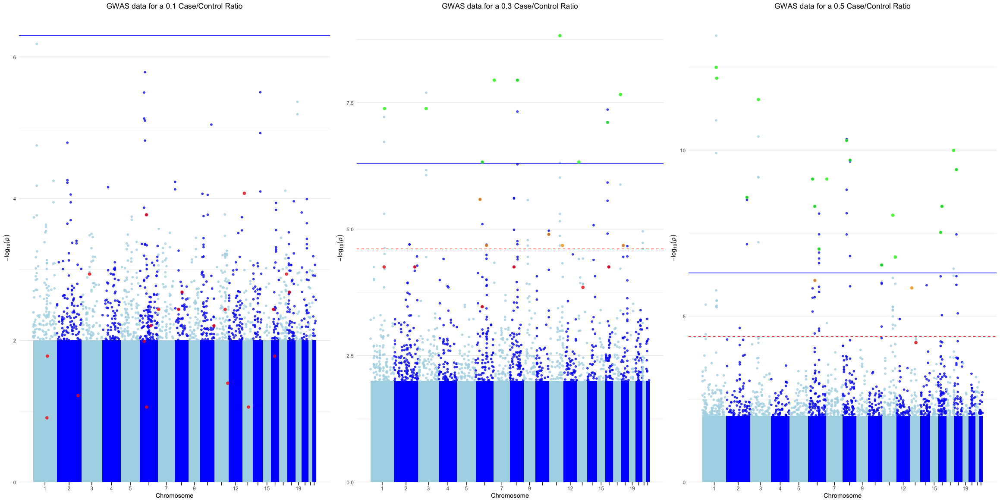
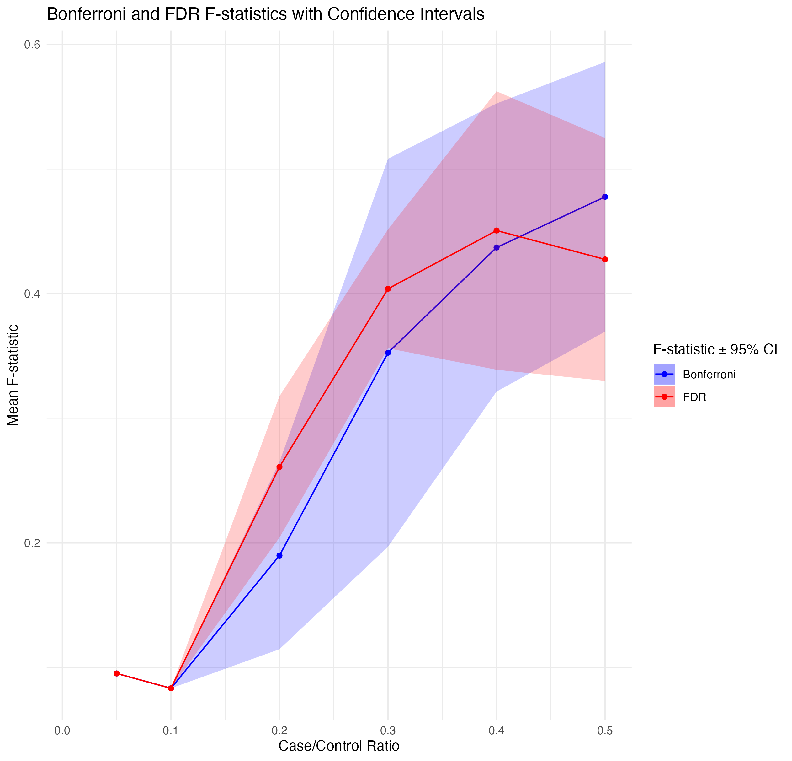

# GWAS_Power_Diss
This is the repository for the code behind my dissertation on Quantifying the Power of GWAS. It includes pure R code to simulate genetic data in a fast and simple manner, as well as code for interpreting results and generating HTML reports.

## Table of Contents

1. [Files](#files)
2. [Generating Genomic Data](#general-framework-for-generating-genomic-data-at-scale)
3. [Statistical Inferences](#general-framework-for-assessing-the-power-of-a-gwas)
4. [Example findings](#example-findings)
5. [Additional Information](#additional-information)

## Files
- [genetic_sim.R](./genetic_sim.R): This file contains the main simulation logic. It is split into three sub-functions designed to simulate genomic data, assign causal SNPs and assign phenotypes
- [genetic_assoc_stats_function.R](./genetic_assoc_stats_function.R): This file contains a plethora of functions designed to generate association statistics for a PLINK --assoc GWAS output. These include power and inflation calculations, Bonferroni and FDR thresholds, F-values and ROC curves.
- [gwas_html_boiler.Rmd](./gwas_html_boiler.Rmd): This is the markdown template for the per-run HTML reports generated. This tracks stats such as run parameters, manhattan and qq plots as well as ROC curves and general association stats. 
- [summary_gwas_html_boiler.Rmd](./summary_gwas_html_boiler.Rmd): This is the markdown template for the per-test summary HTML reports. This plots power, F-scores, AUC and inflation statistics across ALL runs. 
- [ggqqman.R](./ggqqman.R): A custom function to generate qq and manhattan plots using ggplot2.
- [gen_ld_matrix.R](./gen_ld_matrix.R): A custom function to calculate the LD matrix between SNPs based off genotype data. This uses the statistical approach outlined by [T.J.Hui and A.Burt, 2020](https://bmcgenomdata.biomedcentral.com/articles/10.1186/s12863-020-0818-9#citeas). 

## General Framework for Generating Genomic Data at Scale

The **`genetic_sim`** R function outputs genomic data for individuals across specified chromosomes, each with a certain number of SNPs. There are three main parts:

1. Generating SNP genotype data (`simulate_genotype_data`)
2. Assigning causal SNPs (`causal_snp_assignment`)
3. Assigning case phenotypes (`phenotype_assigment`)

### Generating SNP Genotype Data

SNPs are proportionally distributed across chromosomes based on known lengths. The position of each SNP within a chromosome is randomly generated. The LD (Linkage Disequilibrium) value is calculated based on the distance to the previous SNP with the formula:

\[ LD_{k,j} = 0.999^{(pSNP_{k,j} - pSNP_{k,j-1})} \]

MAF (Minor Allele Frequencies) are then generated using a beta distribution and adjusted based on LD:

\[ Adj\_MAF_{k,j} = LD_{k,j} \cdot MAF_{k,j-1} + (1 - LD_{k,j}) \cdot MAF_{k,j} \]

Final genotype frequencies are then based on both the LD and Hardy-Weinburg Equilibriums generated from the adjusted MAF. 

### Assigning Causal SNPs

Next, causal SNPs are selected. These are initially filtered based on:

1. Observed MAF \(\geq\) user-defined causal MAF
2. At least one SNP genotype is not 2

The probability of a filtered SNP being causal is then decided based off how close its observed MAF is to the MAF desired by the user:

\[ P(SNP_j = causal) = \left| maf\_observed_j - causal\_maf_j \right|' \]

Note that SNPs within \(\pm 1\text{kb}\) of selected causal SNPs are excluded in subsequent selections to ensure that final causal SNPs don't lie in high LD with each other.

### Assigning Case vs Control Labels

Finally, the phenotypes of individuals are assigned. Here, the probability of an individual being a case is based on genetic and environmental components with the formula:

\[ 
P(Phenotype_i = case) = heritability_i \cdot (genotype\_effect_i') + (1-heritability_i) \cdot environmental\_effect_i 
\]

Where:

- \( heritability \in [0,1] \)
- \( genotype\_effect = genetic\_weight \cdot \sum_{i=1}^{n} g_{i} \)
- \( environmental\_effect \) is user-defined

Under this model, individuals with high sums of causal genotype scores are more likely to be cases if heritability is high, otherwise environmental effects dominate.

## General Framework for Assessing the Power of a GWAS

The **`genetic_assoc_stats_functions`** file contains a plethora of functions to interrogate the output of a **PLINK -assoc** test. There are several factors that can be investigated: 

1. Threshold Power - How well True Positives are detected at different P-value thresholds.
2. The F-value (F1) - a measure of GWAS accuracy that balances both precision and recall, providing a single metric for evaluating the model's performance.
3. AUC (Area Under the Curve) - this measures the ability of the GWAS to distinguish between true causal variants and non-causal variants.
4. Genomic Inflation (λ)  - a measure used to assess the presence of systematic bias in a GWAS by comparing the observed vs expected p-values. 

## Example findings

Below is an example of the associations observed in GWAS results when modulating the initial phenotype **case/control ratio** within individuals. The first image shows the manhattan plots of GWAS's on data with a 0.1,0.3 and 0.5 case/control ratio. 

As we can see, as the ratio gets bigger and there are a higher number of cases, more of the causal SNPs are detected at both the FDR threshold (red dashed line), and Bonferroni threshold (blue line). The colour of the SNPs represents where they fall on this threshold.

The plot below shows a more statistical interpretation of this trend, measuring the mean F value of each GWAS across the different ratios at both the FDR and Bonferroni threshold. 

Again this demonstrates the same trend that GWAS performs better when the ratio of case:controls is higher. 

## Additional Information
For requests regarding raw data availability and queries on function usage, please message **[Jack Murzynowski](mailto:jack.murzynowski@warwick.ac.uk)**.

